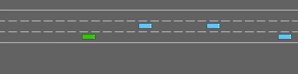
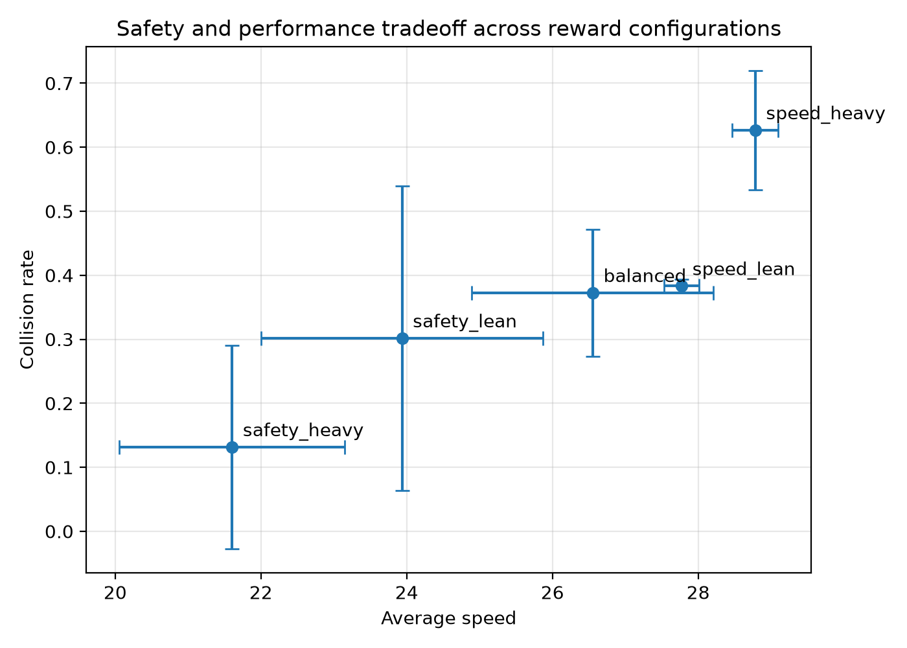

# Yield: Learning to Drive in Traffic

Measuring the safety and performance tradeoff in reinforcement learning.

CS 175: Project in AI, Summer 2026, Group 7.

| Team member | UCI NetID |
|---|---|
| Bala Kausik Vazrala | bvazrala |
| Christopher James Cho | cjcho2 |
| Harrison Nguyen Xuan Hiep Le | harrisnl |

### Aggressive agent (collision penalty 0.2)


### Cautious agent (collision penalty 10)


Both clips are the same evaluation episode, so the two agents face identical traffic.

## Overview

We train DQN agents in the highway-env simulator where the only difference between agents is how heavily the reward penalizes collisions relative to rewarding speed. Five reward configurations, three random seeds each, and a frozen budget of 50,000 training steps per run. The headline result is a tradeoff curve of average speed against collision rate. Full details are in [docs/CS175_Project_Proposal.pdf](docs/CS175_Project_Proposal.pdf).

## Results

Each agent was evaluated over 200 episodes using evaluation seeds no agent saw during training. Values are averaged across the three seeds of each configuration.

| Configuration | Collision penalty | Collision rate | Average speed (m/s) | Mean episode length |
|---|---|---|---|---|
| speed_heavy | 0.2 | 0.627 | 28.78 | 21.0 |
| speed_lean | 0.5 | 0.383 | 27.77 | 24.7 |
| balanced | 1.0 | 0.347 | 26.12 | 25.4 |
| safety_lean | 3.0 | 0.302 | 23.94 | 25.8 |
| safety_heavy | 10.0 | 0.132 | 21.60 | 28.1 |



Both axes move monotonically. Collision rate falls by 79 percent from the most speed weighted setting to the most safety weighted one, and average speed falls by 25 percent alongside it.

The averages hide a split. Three runs found a qualitatively different policy, crashing in 3 to 5 percent of episodes and keeping following distances of 45 to 51 meters. The other twelve crash in 27 to 72 percent of episodes with following distances of 29 to 39 meters. Almost nothing falls between the two groups, so a heavy collision penalty appears to raise the probability that training finds a cautious policy rather than shifting behavior smoothly.

## Repository structure

```
configs/rewards.yaml     The five reward configurations and shared settings
train.py                 Train one agent (one config, one seed)
evaluate.py              Evaluate a saved agent over 200 unseen episodes
validate_cartpole.py     Sanity check for the whole RL stack
plot_tradeoff.py         Build the speed vs collision rate plot from results
record_videos.py         Render rollout videos of saved agents
scripts/run_matrix.sh    Queue the full 5 x 3 experiment matrix sequentially
docs/                    Project proposal
models/                  Saved models and checkpoints (git ignored)
logs/                    Training logs and TensorBoard events (git ignored)
videos/                  Rendered rollouts (git ignored)
results/                 Metrics CSV, plots, videos and frames (tracked in git)
```

## Setup

Python 3.10 or newer.

```
python -m venv .venv
source .venv/bin/activate        # Windows: .venv\Scripts\activate
pip install -r requirements.txt
```

Once the install works on all three laptops, freeze exact versions so every machine trains on identical code:

```
pip freeze > requirements.lock.txt
```

## How to run

1. `python validate_cartpole.py` must pass before anything else. If CartPole trains, every later problem is a highway problem, not an install problem.
2. Smoke test one run end to end: `python train.py --config balanced --seed 0 --steps 3000`. Delete the resulting model afterward so it is not mistaken for a full run.
3. Full matrix: `bash scripts/run_matrix.sh`, or `bash scripts/run_matrix.sh 1` to run only seed 1 on this machine.
4. `python evaluate.py --config <name> --seed <n>` for each finished run, then `python plot_tradeoff.py`.
5. `python record_videos.py --config <name> --seed <n>` on the most aggressive and most cautious agents for the side by side comparison.

Training takes about 8 minutes per run, so the full matrix finishes in roughly 2 hours on one laptop. Evaluation takes about a minute per agent.

## Remaining work

- [ ] Add scripted baseline policies to `evaluate.py` and measure them
- [ ] Repeat the sweep at lower and higher traffic density
- [ ] Add seeds to the safety weighted configurations to pin down the split described above
- [ ] Inspect Q values in rule selected traffic situations
- [ ] Test zero shot transfer to the merge and roundabout scenarios

## Overnight runs

Start inside tmux so the run survives a closed terminal:

```
tmux new -s highway
bash scripts/run_matrix.sh
```

Detach with Ctrl-b then d. Reattach with `tmux attach -t highway`. Live curves: `tensorboard --logdir logs`.

tmux does not survive a sleeping machine. On macOS run the script under `caffeinate -i` and leave the lid open. On Windows set the power plan to never sleep while plugged in and pause updates. On Linux disable automatic suspend. Watch the first run for ten minutes before leaving it: episodes completing, rewards logging, a checkpoint appearing on disk.

## Notes on experimental design

Hyperparameters are frozen in `train.py` and copied from the published highway-env DQN example. The reward specification is the only variable in this study. Every agent is evaluated on the same 200 episodes using evaluation seeds starting at 10,000, which no agent sees during training. Three seeds per configuration exist because RL runs vary considerably between random initializations, so a difference between configurations means nothing until it exceeds the spread between seeds of the same configuration.

Collision rate should fall as the collision penalty grows. That monotonic trend is the directional check, and it held across all five configurations. Seed variance is large at the safety weighted end, where collision rate ranged from 0.03 to 0.475 within a single configuration, so only the most speed weighted setting is cleanly separated from the rest.

## References

1. E. Leurent. An Environment for Autonomous Driving Decision Making. GitHub repository, 2018. https://github.com/eleurent/highway-env
2. A. Raffin et al. Stable-Baselines3: Reliable Reinforcement Learning Implementations. JMLR 22(268), 2021.
3. M. Towers et al. Gymnasium: A Standard Interface for Reinforcement Learning Environments. arXiv:2407.17032, 2024.
4. V. Mnih et al. Human-level control through deep reinforcement learning. Nature 518, 2015.
